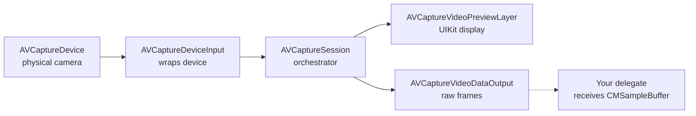

# AVFoundation Camera Pipeline

**TL;DR:** AVFoundation models the camera as a **session** that connects an **input** (the camera device) to one or more **outputs** (preview layer, data frames, photo capture). To get raw frames for ML processing you wire an `AVCaptureVideoDataOutput` and implement a delegate that receives each `CMSampleBuffer` as it arrives.

---

## What it is

The iOS camera stack in one diagram:



A `AVCaptureSession` is the orchestrator. You add inputs (camera devices) and outputs (preview layer, video data, audio, photo, depth). When you call `startRunning()`, the session begins delivering data from inputs to outputs.

For ML use cases, the key output is `AVCaptureVideoDataOutput`, which calls a delegate method **every frame** with a `CMSampleBuffer` wrapping a `CVPixelBuffer`.

---

## Why it matters

**For the project:** Phase 2's whole job. We need camera frames as they arrive (30 fps), run rectangle detection on each, and overlay the result on a live preview.

**For ML engineering:** Every on-device ML pipeline that uses live sensor data follows this shape — **stream → buffer → ML inference → render result back into the stream**. Whether you're doing face detection in Snapchat, AR object placement in IKEA's app, or hand tracking in Vision Pro, the architecture rhymes. AVFoundation is the iOS implementation; the *pattern* generalizes to Android CameraX, web `getUserMedia`, server-side video pipelines, autonomous-vehicle perception stacks.

---

## Key types

| Type | Role | Notes |
|---|---|---|
| `AVCaptureDevice` | Physical camera (back wide, front, ultra-wide, telephoto, true-depth, lidar) | `default(.builtInWideAngleCamera, for: .video, position: .back)` |
| `AVCaptureDeviceInput` | Wraps a device for the session | Throws if camera busy |
| `AVCaptureSession` | The hub | Configure between `beginConfiguration()` / `commitConfiguration()` |
| `AVCaptureVideoDataOutput` | Streams `CMSampleBuffer` to your delegate | Has its own queue |
| `AVCaptureVideoPreviewLayer` | A `CALayer` that displays the live feed | Lives in a UIView, not a separate output you query |
| `CMSampleBuffer` | Wraps the actual pixel data + timing | Get the pixel buffer via `CMSampleBufferGetImageBuffer` |
| `CVPixelBuffer` | The pixel data itself (YUV, BGRA, RGB, etc.) | Lockable for direct memory access |

---

## Threading model

This is where everyone trips. AVFoundation imposes specific threading rules:

- **Configuration** (`beginConfiguration`, `addInput`, `addOutput`) — block within `beginConfiguration` / `commitConfiguration`. Should run off the main queue because configuration is slow.
- **`session.startRunning()`** — slow (often 500+ ms). MUST run off the main queue or your UI freezes.
- **Delegate callbacks** — fire on a queue you specify when you call `setSampleBufferDelegate(_:queue:)`. Choose a serial queue dedicated to processing. Never the main queue.
- **UI updates** from delegate callbacks — must dispatch to main.

If you ignore these you get glitchy UI, dropped frames, and Apple's warning logs.

```swift
let processingQueue = DispatchQueue(label: "com.cgerrity.processing", qos: .userInitiated)

// Configuration off main:
Task.detached { configureSession() }

// startRunning off main:
Task.detached { session.startRunning() }

// Delegate runs on processingQueue:
videoOutput.setSampleBufferDelegate(self, queue: processingQueue)

// In delegate, update UI on main:
DispatchQueue.main.async { self.detectedQuad = quad }
```

---

## Pixel formats

`AVCaptureVideoDataOutput` delivers `CMSampleBuffer` in a configurable pixel format. The defaults:

- **`420YpCbCr8BiPlanarFullRange`** (YUV) — what the camera natively delivers; cheapest.
- **`32BGRA`** — easier for ML and OpenCV-style code, but costs a color conversion.

For Vision framework requests (`VNDetectRectanglesRequest`, `VNRecognizeTextRequest`, etc.), either format works — Vision handles internally. For Core ML inputs that expect a specific format (RGB), explicit BGRA is convenient.

```swift
videoOutput.videoSettings = [
    kCVPixelBufferPixelFormatTypeKey as String: kCVPixelFormatType_32BGRA
]
```

The trade-off: each frame at 1080p in BGRA is 8 MB. At 30 fps that's 240 MB/s of memory churn. Don't store buffers; process and drop.

---

## Frame dropping

When your delegate is slow, frames pile up. `AVCaptureVideoDataOutput.alwaysDiscardsLateVideoFrames = true` tells AVFoundation to drop frames rather than queue them. **You almost always want this for real-time ML** — better to skip frames than to lag.

---

## Orientation

This is the most confusing part of AVFoundation. Three "orientations" matter:

- **Camera sensor orientation** — fixed by hardware. Back camera on iPhone is mounted at 90° to the device's portrait orientation.
- **Device orientation** — current physical rotation of the phone.
- **Interface orientation** — what your UI thinks "up" is.

By default, the raw pixel buffer your delegate receives is in **camera sensor orientation** (landscape-left for the back camera on iPhone in portrait). You need to either:

- **Rotate the buffer** before processing (set `connection.videoRotationAngle = 90` — iOS 17+).
- **Tell consumers the buffer's orientation** (pass `.right` to Vision's `VNImageRequestHandler`).

Apple's `videoRotationAngle` API (iOS 17+) replaces the older deprecated `videoOrientation` enum.

---

## The preview layer

`AVCaptureVideoPreviewLayer` is a `CALayer` subclass that renders the camera feed directly — efficiently, with hardware compositing. You display it by:

1. Setting it as the `layerClass` of a custom `UIView`:
   ```swift
   final class PreviewUIView: UIView {
       override class var layerClass: AnyClass { AVCaptureVideoPreviewLayer.self }
       var previewLayer: AVCaptureVideoPreviewLayer { layer as! AVCaptureVideoPreviewLayer }
   }
   ```
   Overriding `layerClass` is the standard pattern — much more efficient than adding the preview as a sublayer.

2. Pointing it at the session:
   ```swift
   view.previewLayer.session = session
   view.previewLayer.videoGravity = .resizeAspectFill
   ```

3. Wrapping the `UIView` in a SwiftUI `UIViewRepresentable`.

The preview layer auto-updates as the session runs. You don't need to feed it frames.

---

## In Phase 2 of this project

Our `CardDetectionService`:

- Creates an `AVCaptureSession` with the back wide-angle camera as input
- Adds an `AVCaptureVideoDataOutput` with our class as the delegate
- Calls `startRunning()` on a background queue
- In the delegate callback, runs Vision's `VNDetectRectanglesRequest` on each frame
- Publishes the detected quad to SwiftUI state on main

The preview layer is shared with the SwiftUI view via the same session.

---

## Watch out for

- **Camera in iOS Simulator:** historically nonexistent; Xcode 15+ can route the host Mac's camera (Continuity Camera or built-in). Enable via Simulator → Features → Camera. For real Phase 2 testing, deploy to a physical device.
- **AVCaptureSession is not Codable / Equatable / @Sendable.** Don't try to put it in `@State` directly — wrap in an observable owner.
- **`startRunning()` blocks for up to 1 second.** Always run on a background queue.
- **Forgetting to remove inputs/outputs when reconfiguring** leaves dangling references.
- **Memory pressure from buffer retention.** Don't accumulate frames in arrays. Process and let the buffer release.
- **`requestAccess(for: .video)` returns immediately as `denied` if Info.plist lacks `NSCameraUsageDescription`.** No dialog appears. See [info-plist.md](info-plist.md).

---

## See also

- [Info.plist](info-plist.md) — permission usage descriptions
- [SwiftUI ↔ UIKit bridging](swiftui-uikit-bridging.md) — embedding the preview layer
- [Coordinate spaces in iOS imaging](coordinate-spaces.md) — Vision vs UIKit vs CoreImage origins

---

## Interview angle

> **"How do you do real-time ML inference on a video stream on mobile?"**

A senior answer covers:

1. The camera-pipeline model: session → input → output → delegate, off main thread
2. Frame-dropping policy under load (drop late frames; don't queue)
3. Per-frame Core ML / Vision inference; profile latency budget against frame rate
4. Coordinate-space conversions (sensor → image → UI → model)
5. Power and thermal considerations — sustained 30 fps inference can throttle the device
6. The Neural Engine (ANE) vs GPU vs CPU trade-off for the model

Bonus: bring up `Vision`'s built-in feature detectors (rectangles, text, faces, body pose, hand pose) as off-the-shelf tools you compose with your own models. Most production camera ML pipelines mix off-the-shelf detectors and custom models.
