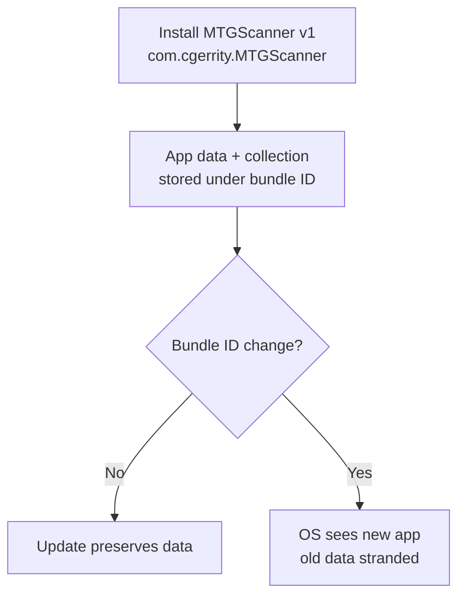

# Bundle Identifiers

**TL;DR:** A bundle identifier is a unique string iOS uses to identify your app. Reverse-DNS style (`com.cgerrity.MTGScanner`). Once you ship with one, **don't change it** — iOS treats a new bundle ID as a brand-new app.

---

## What it is

Every iOS app has a **bundle identifier (CFBundleIdentifier)** stored in its `Info.plist`. It's an arbitrary string but Apple's convention is **reverse-DNS**:

```
com.cgerrity.MTGScanner
└┬┘ └───┬───┘ └────┬────┘
 │      │          │
 │      │          └─ app name (CamelCase or kebab — pick one and stick)
 │      └─ your namespace (your name, company, or owned domain)
 └─ TLD (always "com" by convention, even if you don't own a .com)
```

You don't need to own a `.com`. The string just needs to be unique among apps on the device and within your Apple developer scope.

---

## Why it matters

Bundle ID is iOS's **primary key for your app identity**. The OS uses it to scope:

- **App sandbox storage** (the directory where your app's files live)
- **NSUserDefaults preferences**
- **Keychain entries** (unless explicitly shared via keychain groups)
- **CloudKit container** (a CloudKit "container" is `iCloud.<bundleID>` by default)
- **Push notifications target**
- **App Store listing** (one bundle ID = one app on the store)
- **Code signing identity** (provisioning profiles bind to bundle IDs)

If you change the bundle ID after shipping, the OS sees a **brand-new app**. The user's data, settings, and login tokens don't migrate. The CloudKit container is different. Re-acquiring app permissions starts over.



---

## In this project

We picked `com.cgerrity.MTGScanner` and locked it. Implications:

- **CloudKit container will be `iCloud.com.cgerrity.MTGScanner`** when we add sync in Phase 8.
- **Free Apple ID quota:** A free Apple ID can sign up to 10 distinct app IDs at once. We use one slot.
- **Keychain entries** scoped to this bundle ID. If we add other related apps later (e.g. a Mac companion), we'd add a keychain group entitlement to share secrets between them.

---

## Free Apple ID specifics

Personal sideload (no $99/yr Apple Developer Program) has constraints:

- **7-day signature expiry.** Re-sign the app every 7 days by rebuilding from Xcode.
- **3-app limit per device** for a single free Apple ID.
- **10-app-ID quota** per Apple ID across all devices.
- **No CloudKit production environment.** Only development environment available — fine for personal use.
- **No App Store distribution.** That requires the paid Developer Program.

These are quotas, not technical limitations. For a personal scanner used by one person, free Apple ID is sufficient.

---

## Watch out for

- **Don't pick a "throwaway" bundle ID early then change it.** Pick once.
- **Bundle ID is case-sensitive on iOS** for some purposes but not all — keep one canonical form.
- **Don't put PII in the bundle ID.** It's visible in many contexts (App Store, logs, crash reports).
- **CloudKit container IDs are independent strings** but conventionally match the bundle ID. We'll keep them aligned.
- **Re-installing an app with the same bundle ID** preserves the user's data store on disk. This is usually what you want — but during development, sometimes you want a clean slate. Delete the app from the device first.

---

## How to set it in Xcode

In Phase 2 we'll create the project and pick this in:

```
Project Navigator → MTGScanner target → General tab → Identity → Bundle Identifier
```

You can also set it in the project's `.pbxproj` directly (text-editable, but Xcode prefers you go through the UI).

---

## See also

- iOS Code Signing (Phase 2 — link to be added)
- CloudKit container scoping (Phase 8 — link to be added)

---

## Interview angle

Bundle IDs come up in iOS engineering interviews, but rarely in ML engineering ones. The transferable lesson — **identity stability matters; reserve an immutable key for your system's identity early** — applies broadly:

- ML model registries use immutable model IDs that are stable forever
- Database primary keys should never be reassigned
- Public API endpoints should have stable URLs
- Cloud resource IDs (AWS ARN, GCP resource names) are immutable for a reason
