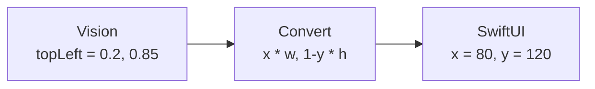

# Coordinate Spaces in iOS Imaging

**TL;DR:** Vision uses origin **lower-left**, normalized `(0...1)`. UIKit and Core Graphics use origin **upper-left**, points. Core Image uses origin **lower-left**, pixels. Converting between them is a y-flip plus a scale. Get it wrong and your overlay appears mirrored, off-screen, or upside-down.

---

## What it is

Apple's imaging frameworks were built across decades and inherited conflicting conventions. The key ones:

| Framework | Origin | Units | Notes |
|---|---|---|---|
| **Vision** | lower-left | normalized 0...1 | `VNRectangleObservation.topLeft` etc. |
| **UIKit / SwiftUI** | upper-left | points (1pt ≈ 1/163in) | What we draw with |
| **Core Image** | lower-left | pixels | Adopts the "math-textbook" convention |
| **Core Graphics (Quartz)** | lower-left on macOS, upper-left on iOS | points | Argh |
| **AVFoundation buffer coordinates** | upper-left | pixels | In native sensor orientation |
| **Metal** | varies | normalized device coords (-1...1) | GPU specifics |

Vision returns coordinates relative to the image you passed in, in its own *normalized lower-left* space. UIKit/SwiftUI draws relative to the screen in *points, upper-left*. **You must convert.**

---

## Why it matters

**For the project:** Phase 2's overlay draws a green outline around the detected card. Vision gives us `topLeft = (0.20, 0.85)` meaning "20% across, 85% up from the bottom." If we render that as-is in SwiftUI it appears 20% from the left and 85% from the **top** — flipped vertically.

**For ML engineering jobs:** Coordinate-space mismatches are a category of bug that recurs everywhere — OpenCV vs PIL, GPU NDC vs screen, image-classifier model expecting `(C, H, W)` vs the dataloader supplying `(H, W, C)`. Senior engineers smell these bugs before debugging them.

---

## The Vision → SwiftUI conversion

```swift
extension CGPoint {
    /// Vision space (origin lower-left, normalized 0...1)
    /// → SwiftUI space (origin upper-left, points)
    func toSwiftUI(in size: CGSize) -> CGPoint {
        CGPoint(
            x: x * size.width,
            y: (1 - y) * size.height   // <-- the y-flip
        )
    }
}
```

Worked example. Vision says: card's topLeft is at `(0.2, 0.85)`. The view is 400×800 pt.

- x: `0.2 × 400 = 80` pt from left
- y: `(1 - 0.85) × 800 = 120` pt from top

So the SwiftUI overlay draws a corner at `(80, 120)`. ✓



---

## Other conversions you'll need

### Vision → UIKit pixel coordinates (for cropping an image)

```swift
// pixelImageSize: CGSize of the original image in pixels
let pixelPoint = CGPoint(
    x: visionPoint.x * pixelImageSize.width,
    y: (1 - visionPoint.y) * pixelImageSize.height
)
```

### Core Image → SwiftUI

Core Image is lower-left pixels. To overlay over a SwiftUI image at the same size:

```swift
let swiftUIPoint = CGPoint(
    x: ciPixelPoint.x,
    y: imageSize.height - ciPixelPoint.y
)
```

### UIKit screen → image coordinates

When the user taps the screen and you want to know what camera-pixel they tapped, you need:
1. The view's coordinate space (upper-left points)
2. The image's coordinate space (upper-left pixels)
3. Any aspect-fit / aspect-fill scaling between them

Apple's `AVCaptureVideoPreviewLayer` provides `metadataOutputRectConverted(fromLayerRect:)` and `layerRectConverted(fromMetadataOutputRect:)` to do this for you. Use them — getting the math right manually is error-prone, especially with aspect-fill.

---

## Aspect-fill / aspect-fit complications

`AVCaptureVideoPreviewLayer.videoGravity = .resizeAspectFill` makes the preview fill the view, **cropping** parts of the camera image that don't fit. The corners reported by Vision are relative to the **full camera frame**, but the user only *sees* the cropped portion.

So a Vision corner at `(0.0, 0.0)` (bottom-left of the original frame) might be off-screen because we cropped that area. Three options:

1. **Use `videoGravity = .resizeAspect`** — letterboxes if needed but every Vision corner is visible. Less polished UX.
2. **Use the preview layer's conversion APIs** — they know about the gravity setting. Always correct.
3. **Crop in software** before passing to Vision so the preview and the detection are aligned. Most flexible.

For Phase 2 we use approach 1 in the early version (letterboxing) to keep math simple, switching to approach 2 once we add zoom or pan.

---

## Watch out for

- **Mirroring on front camera.** Front camera output is horizontally mirrored. If we ever support the front camera, the x-axis converts via `1 - x`, not just `x`.
- **Device orientation changes after Vision runs.** If the user rotates the phone between frame capture and overlay rendering, your math is one frame out of date. Usually negligible at 30 fps.
- **Mixing pixels and points.** `UIScreen.main.scale` is 3 on most iPhones — 3 pixels per point. Doing math in pixels when the rest of the code uses points (or vice versa) makes drawings 3× off.
- **Off-by-one at exact `0` or `1` boundaries.** Vision occasionally reports `1.0001` due to floating point. Clamp if you're using the value as an array index.
- **Sample-buffer orientation.** AVFoundation buffers are in *sensor* orientation, not portrait. Either rotate the buffer or pass the orientation to Vision. See [avfoundation-camera-pipeline.md](avfoundation-camera-pipeline.md).

---

## In Phase 2

Our `CardCornerOverlay` calls `point.toSwiftUI(in: geo.size)` for each Vision corner, then strokes a `Path`. Because the camera buffer is rotated to portrait before Vision sees it (via `connection.videoRotationAngle = 90`), Vision uses `.up` orientation and the conversion is the simple form shown above.

---

## See also

- [AVFoundation camera pipeline](avfoundation-camera-pipeline.md)
- [SwiftUI ↔ UIKit bridging](swiftui-uikit-bridging.md)

---

## Interview angle

> **"What's a hard-to-debug ML bug you've shipped?"**

A great answer involves coordinate spaces somewhere. "Our overlay was correctly drawn, just mirrored — we'd assumed the model's output was in screen space, but it was in image space, and the image had a different aspect ratio." Senior interviewers love these because the lesson generalizes.

> **"Explain the difference between normalized device coordinates, image coordinates, and screen coordinates."**

Be ready to draw the three conventions and walk through one conversion. Bonus points for naming a framework's quirks (Vision lower-left, UIKit upper-left, OpenGL/Metal NDC -1...1).
