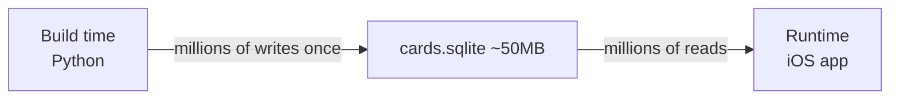

# SQLite for Read-Mostly Workloads

**TL;DR:** SQLite is a small but production-grade database that lives in a single file. For on-device use where writes happen once at build time and reads happen at runtime, design the schema around the read patterns: covering indices, `WITHOUT ROWID` for TEXT primary keys, `ANALYZE` + `VACUUM` at end of build.

---

## What it is

SQLite is a **library**, not a server. Your application links it and calls C functions; the database is a single file on disk. It's installed on every iPhone, Android device, macOS install, Windows install. By weight of deployments it's the most-used database in the world.

For our project we have a **read-mostly workload**:



Reads are: lookup a card by `(set_code, collector_number, language)`, or fuzzy-search by name. Writes never happen at runtime — the DB is shipped pre-populated.

---

## Why it matters

**For the project:** Getting the schema right at the start saves us from reindexing 100K rows later when we realize the lookup pattern.

**For ML engineering jobs:** SQLite shows up in:

- **Feature stores for small services** (when Redis is overkill and Postgres is overkill)
- **ML model registries** on disk
- **Local cache layers** for inference services
- **Training data manifests** (a SQLite DB pointing at S3 keys)
- **Offline analytics tools** (DuckDB is conceptually similar — columnar SQLite for analytics)

Knowing how to design a SQLite schema well is genuine production-engineering knowledge.

---

## Read-mostly schema design choices

### 1. Pick primary keys aligned with your most-common lookup

Our most-common query in the app:

```sql
SELECT * FROM cards
WHERE set_code = ? AND collector_number = ? AND language = ?;
```

We can satisfy this with an index. Adding `UNIQUE INDEX idx_cards_lookup ON cards(set_code, collector_number, language)` lets SQLite find the row in O(log n) without scanning. If this were the only query, we'd actually make it the primary key.

We don't because we also need to look up by Scryfall UUID (e.g. in disambiguator flag joins). So `id` (UUID) is the PK and `(set, collector#, lang)` is a unique index.

### 2. `WITHOUT ROWID` for TEXT primary keys

By default, every SQLite table has a hidden 64-bit integer `rowid`. If your PK is TEXT (like our Scryfall UUIDs), the row is stored under the rowid, and SQLite maintains a separate index from PK → rowid. **Two B-trees per table.**

`CREATE TABLE ... WITHOUT ROWID` removes the rowid and stores rows directly by their PK. **One B-tree.** Lower disk usage and faster lookups when the PK is TEXT.

```sql
CREATE TABLE cards (
    id TEXT PRIMARY KEY,
    ...
) WITHOUT ROWID;
```

Trade-off: WITHOUT ROWID tables have row-size limits and some FTS5 patterns work differently. Worth it for small to medium tables with TEXT PKs.

### 3. `ANALYZE` + `VACUUM` at end of build

After bulk inserting, run:

```sql
ANALYZE;   -- gather statistics so the query planner picks good indexes
VACUUM;    -- defragment + reclaim space; can shrink DB significantly
```

These run once at build time and pay off for every read at runtime. Skipping them often costs 2× DB size and slower queries.

### 4. Choose FTS5 trigram tokenizer for fuzzy name search

`unicode61` (default) tokenizes by word. Matches "lightning" → "Lightning Bolt" via prefix `MATCH 'lightning*'`.

`trigram` tokenizes by 3-character substrings. Matches "ightning Bo" against "Lightning Bolt" because they share trigrams. **Better for partial OCR**, which is exactly our case.

```sql
CREATE VIRTUAL TABLE cards_name_fts USING fts5(
    card_id UNINDEXED,
    name,
    tokenize='trigram'
);
```

The trigram tokenizer is in SQLite ≥3.34. macOS-shipped SQLite is way past that.

### 5. Foreign keys: document, optionally enforce

`FOREIGN KEY (set_code) REFERENCES sets(code)` in your schema serves as **documentation** even when not enforced. Enforcement requires `PRAGMA foreign_keys = ON;` per connection. For a build-script-controlled DB, enforcement is optional.

### 6. Page size

`PRAGMA page_size = 4096;` (default on macOS) is fine. Larger pages can speed up large-row tables; smaller pages help with many small tables. Default works.

---

## Watch out for

- **N+1 reads.** A single `SELECT ... WHERE id IN (?, ?, ?, ...)` is much faster than 1000 individual lookups. SQLite supports IN-clauses up to thousands of items.
- **Implicit transactions.** Every `INSERT` is its own transaction unless you wrap with `BEGIN/COMMIT`. Wrapping bulk inserts in a single transaction can be **100× faster**.
- **The query planner needs ANALYZE.** If your tests pass on small data but production queries are slow, check whether ANALYZE was run.
- **WAL mode for concurrent reads + writes.** Not relevant for our read-mostly workload but standard for write-heavy SQLite use.
- **JSON columns.** Modern SQLite supports JSON1 well. We use it for `disambiguator_flags.args_json`. Don't abuse — querying inside JSON is slower than column access.

---

## In this project (Phase 1)

Our schema:

| Table | Purpose | Index strategy |
|---|---|---|
| `cards` | One row per (set, collector#, lang) printing | `UNIQUE INDEX (set_code, collector_number, language)` for Tier 1 lookup |
| `sets` | Set metadata | PRIMARY KEY on set code |
| `disambiguator_flags` | Per-card flags for Phase 6 modules | PK on (card_id, flag_name) |
| `meta` | Build provenance (Scryfall version, SHA256) | PK on key |
| `cards_name_fts` | Fuzzy name search | FTS5 trigram tokenizer |

Build script flow:
1. Apply schema
2. Stream-parse Scryfall JSON, transform, batch insert (5000 at a time, single transaction per batch)
3. Detect ambiguous (name, set) pairs, write disambiguator flags
4. Write meta rows (build provenance)
5. `ANALYZE` + `VACUUM`

End result: `cards.sqlite` ≈ 50–80 MB, ready to ship.

---

## See also

- [Streaming large data](../ml-engineering/streaming-large-data.md) — the JSON parser feeds streaming inserts
- [Reproducible pipelines](../ml-engineering/reproducible-pipelines.md) — the `meta` table is our reproducibility receipt

---

## Interview angle

SQLite design isn't a common standalone interview topic, but **schema design** is core. Common question forms:

> **"You have 100M rows and need to answer query Q1 fast. Walk me through the schema."**

A senior answer:

1. Look at the query first: what's the predicate? What columns are projected? What's the cardinality?
2. Pick the primary key to match the most common lookup pattern.
3. Add covering indices for secondary queries.
4. Choose denormalization vs joins based on read/write ratio.
5. Know your DB's quirks (SQLite's WITHOUT ROWID, Postgres's BRIN indices, etc.).

The general principle: **schema follows queries, not the other way around.**
