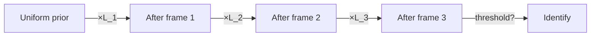

# Bayesian Streaming Inference

**TL;DR:** When evidence arrives in chunks and you want a running belief about which hypothesis is true, maintain a posterior probability and update it with each new observation. Do the math in **log space** to avoid numerical underflow.

---

## What it is

You have a set of hypotheses (candidate cards in our case). Each new observation (one OCR'd video frame) shifts your belief about which one is correct. Bayesian streaming inference is the recipe for updating that belief continuously.

The core equation, applied to one observation:

$$P(c \mid f_{1..t}) \propto P(c \mid f_{1..t-1}) \cdot P(f_t \mid c)$$

In words: **new posterior = old posterior × likelihood of the new observation given each hypothesis**. Normalize so probabilities sum to 1.

You don't need to store all past frames. The posterior **is** the summary of all evidence so far. That's the magic — bounded memory regardless of observation count.

---

## Why it matters

**For the project:** Phase 5 multi-frame confidence accumulator. We identify a card from a video stream. Each frame's OCR is noisy. After enough frames, the posterior on the true card dominates and we trigger identification.

**For ML engineering jobs:** Streaming Bayesian methods appear in:

- **Online click-through-rate models** (Thompson sampling, Beta-Bernoulli updates)
- **A/B test sequential analyzers** (continuous monitoring without inflated false positive rate — see "always-valid p-values")
- **Sensor fusion** (Kalman filters are a special case of Bayesian streaming with Gaussian priors)
- **Spam filtering** (online naive Bayes)
- **Anomaly detection** (online posterior over "normal" parameters)
- **Reinforcement learning** (posterior over Q-values or value functions)

Even when not strictly Bayesian, the **pattern** — "maintain compact running state, update on each observation, emit a decision when confidence threshold met" — is ubiquitous.

---

## The math walked through

Suppose we have 3 candidate cards `A`, `B`, `C`. Initially no evidence — uniform prior.

| Frame | $P(A)$ | $P(B)$ | $P(C)$ | What the OCR saw |
|---|---|---|---|---|
| 0 (prior) | 0.333 | 0.333 | 0.333 | — |
| 1 | 0.700 | 0.250 | 0.050 | "Lightning B…" — A is Lightning Bolt, B is Lightning Helix, C is Brainstorm |
| 2 | 0.946 | 0.054 | <0.001 | "…ning Bolt" — A's likelihood dominates |
| 3 | 0.991 | 0.009 | — | "{R}" — mana cost favors A |
| ... | ... | ... | ... | Identified once $\max P > 0.99$ |

Each step multiplies the previous posterior by the new likelihood and renormalizes.



---

## Log space — why and how

Multiplying many small probabilities together underflows fast. After 30 frames each contributing a likelihood around 0.1, you have $10^{-30}$ — fine in fp64, dicey in fp32, gone in fp16.

The fix: store and add **log-likelihoods**:

$$\log P(c \mid f_{1..t}) = \log P(c \mid f_{1..t-1}) + \log P(f_t \mid c) - \log Z_t$$

where $Z_t$ is a normalizing constant computed at each step via the **log-sum-exp trick**:

$$\log\sum_i e^{x_i} = m + \log\sum_i e^{x_i - m}, \quad m = \max_i x_i$$

Subtracting the max before exponentiating prevents overflow. `scipy.special.logsumexp` does this for you in Python; in Swift we'll roll our own (it's ~10 lines).

```python
import math

def logsumexp(xs):
    m = max(xs)
    return m + math.log(sum(math.exp(x - m) for x in xs))

# Update step:
def update(log_posterior, log_likelihoods):
    log_unnorm = {c: log_posterior[c] + log_likelihoods[c] for c in log_posterior}
    log_z = logsumexp(log_unnorm.values())
    return {c: lp - log_z for c, lp in log_unnorm.items()}
```

---

## Resetting state

A streaming Bayesian system must know when to **reset** — otherwise it accumulates evidence forever about whatever card it first saw.

Strategies:

- **Change-point detection:** if no card is detected for N consecutive frames, reset.
- **Implicit reset on identification:** once we lock in a card, clear state for the next scan.
- **Sliding window with decay:** multiply existing log-posterior by a discount factor (< 1) each frame. Old evidence fades. Standard in sensor fusion.

In Phase 5 we use change-point detection: corners-not-detected for N frames → reset.

---

## Watch out for

- **Zero likelihoods.** Assigning $P(f \mid c) = 0$ to any hypothesis kills it forever — you can never recover even with perfect later evidence. **Always smooth** with a small epsilon ($P \to (1-\epsilon)P + \epsilon \cdot \text{uniform}$).
- **Independence assumption.** The math assumes successive frames are independent given the card. They're not — same card, same lighting, same angle. You're often **over-confident** as a result. Either explicitly model the correlation (HMM-style) or apply a temperature to the final posterior to deflate it.
- **Uncalibrated likelihoods.** If your OCR confidences aren't true probabilities, your posterior values are vibes. See [confidence calibration](#) (to be written when Phase 4 hits).
- **Numerical edge cases.** What happens with one candidate? With ties? Test these.

---

## Phase 5 implementation sketch (Swift)

```swift
struct BayesianAccumulator {
    private(set) var logPosterior: [CardID: Double] = [:]
    let logThreshold: Double = log(0.99)

    mutating func update(observation: OCRObservation, candidates: Set<CardID>) {
        // Initialize uniform prior for any new candidate.
        let uniformLog = -log(Double(candidates.count))
        for cid in candidates where logPosterior[cid] == nil {
            logPosterior[cid] = uniformLog
        }
        // Add log-likelihood for each candidate.
        for cid in candidates {
            logPosterior[cid]! += observation.logLikelihood(forCard: cid)
        }
        normalize()
    }

    private mutating func normalize() {
        let values = logPosterior.values
        let m = values.max()!
        let logZ = m + log(values.map { exp($0 - m) }.reduce(0, +))
        for cid in logPosterior.keys {
            logPosterior[cid]! -= logZ
        }
    }

    var identified: CardID? {
        guard let best = logPosterior.max(by: { $0.value < $1.value }) else { return nil }
        return best.value > logThreshold ? best.key : nil
    }

    mutating func reset() { logPosterior.removeAll() }
}
```

---

## See also

- [Reproducible pipelines](reproducible-pipelines.md) — set seeds when comparing posteriors across runs
- [Streaming large data](streaming-large-data.md) — Bayesian streaming is a special case: process one observation at a time, retain only the posterior

---

## Interview angle

> **"Design a system that identifies an object from a video stream as quickly and confidently as possible."**

The Bayesian-streaming framing is one of two natural answers; the other is a **learned temporal model** — RNN or Transformer over frame embeddings, trained end-to-end.

- Bayesian wins on interpretability, calibratability, and zero training data needed.
- Learned wins on raw accuracy when you have labeled video data and the patterns are subtle.

Show you can articulate both. Mention you'd implement Bayesian first as a baseline, then add a learned model if metrics demand it.

> **"What's the log-sum-exp trick and when do you use it?"**

This one comes up. The answer is the one-liner: it lets you compute $\log\sum_i e^{x_i}$ without overflow by subtracting the max first. Used in: softmax computation, Bayesian normalization, computing log-partition functions, beam search.
