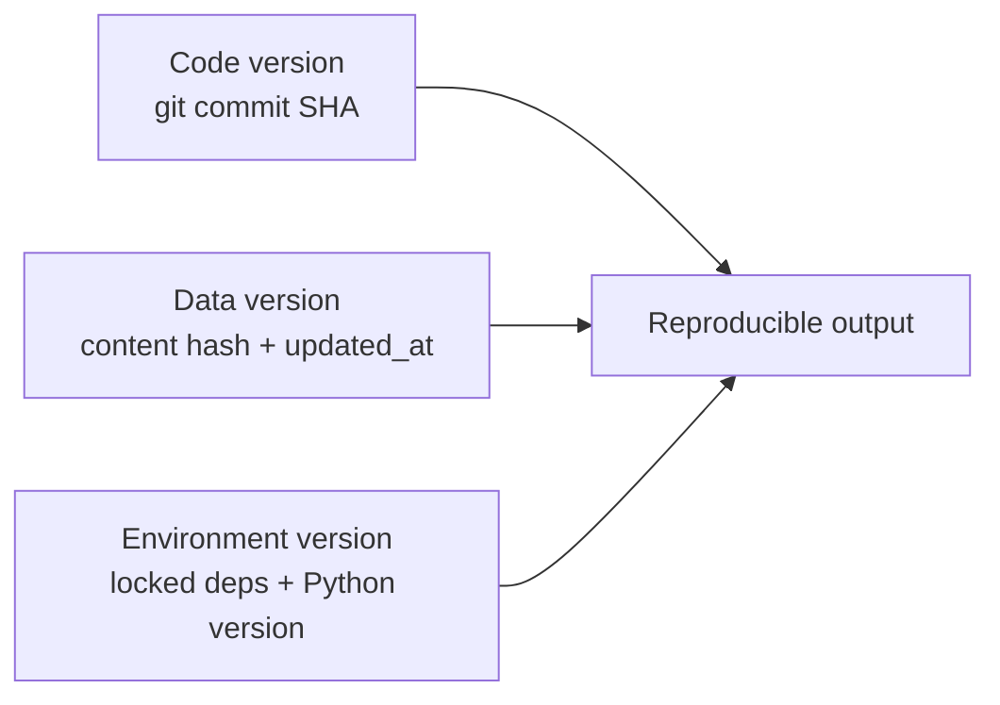

# Reproducible Pipelines

**TL;DR:** A reproducible pipeline produces the same output from the same inputs, every time, on any machine. Three things must be pinned: **code, data, environment**.

---

## What it is

A pipeline — data ingestion, feature engineering, training, evaluation — is **reproducible** when re-running it tomorrow on a teammate's laptop produces the same results given the same inputs.

This is harder than it sounds because pipelines accidentally depend on hidden state:

- Wall-clock time (`datetime.now()` baked into a filename)
- Random seeds (training that uses unseeded `random.shuffle()`)
- Source data that changed underneath you (the live Scryfall API yesterday vs today)
- Library versions (NumPy 1.x vs 2.x changed default RNG behavior)
- Operating-system-specific behavior (file ordering, locale, encoding)

---

## Why it matters

**For the project:** Bug reports become debuggable. "I ran the pipeline and got a different DB" turns from a mystery into a 5-minute fix.

**For ML engineering jobs:** Near-universal interview territory:

- "How would you ensure your model training is reproducible?"
- "What goes into your `pyproject.toml`?"
- "How do you version your data?"
- "Walk me through your training pipeline."

Reproducibility is not a standalone topic. It's a **quality dimension** running through every conversation about ML systems. Bringing it up unprompted in interviews signals senior-engineer thinking.

---

## The three pillars

### 1. Code version

Use git. Tag/commit-sha every artifact you produce. Don't run training from uncommitted code in production. A trained model in your registry should carry the commit SHA it was produced from.

### 2. Data version

Record what data went in. Three options, in order of robustness:

- **Content hash (best):** SHA256 the input file. If anyone changes a byte, you know.
- **Source-provided version stamp:** e.g. Scryfall's `updated_at` timestamp. Not 100% trustworthy (sources can silently fix data) but free.
- **Snapshot the data:** copy the input to versioned storage (S3 with versioning, DVC, lakeFS).

In this project: `scryfall_download.py` writes a sidecar JSON with the SHA256 + `updated_at`. The build script copies these into the SQLite `meta` table.

### 3. Environment version

Record what tools were used:

- Python version (`requires-python = ">=3.11"` in `pyproject.toml`)
- Direct dependency versions (`requirements.txt` with pins)
- Transitive dependency versions (a lockfile — `pip freeze > requirements.lock`, `pip-tools`, `uv lock`)

For production ML you'd also pin OS / CUDA / driver — for our scope, Python deps suffice.

---

## How we do it in this project

When `build_db.py` runs, it stores in the SQLite `meta` table:

| Key | Value |
|---|---|
| `db_version` | Our schema version, bumped on incompatible changes |
| `scryfall_updated_at` | Version stamp from Scryfall |
| `scryfall_sha256` | Content hash of the source JSON |
| `source_file` | Filename we read from |
| `source_size_bytes` | Sanity check |

If anyone ever reports "the DB is wrong," we can query this and answer "the DB was built from Scryfall snapshot X at time Y."

---

## Watch out for

- **Implicit randomness.** Many libraries seed RNGs from time. Set seeds explicitly.
- **Sort stability.** "Pick the top-K by score" is undefined when scores tie. Add a tiebreaker.
- **Floating-point non-determinism on GPU.** Same training data + same seed can still differ across GPU hardware. Document the determinism caveats.
- **Tests that assert exact output but use today's date inside the code.** Freeze time in tests.
- **Cached intermediates that go stale.** If you cache a transform output, version the cache key by the input version and the code version.

---

## See also

- [Streaming large data](streaming-large-data.md) — large pipelines force streaming, which complicates reproducibility (order-dependent state)
- [Dependency management](../python-tooling/dependency-management.md) — pinning is core to environment reproducibility

---

## Interview angle

> **"Walk me through how you ensure your training pipeline is reproducible."**

A senior answer covers:

1. Code in git, commit SHA recorded with every model in the registry
2. Data versioned (hash or snapshot), version recorded with the model
3. Environment locked (pinned deps, container hash for production)
4. Seeds set explicitly; document determinism caveats (e.g. cuDNN nondeterminism)
5. Output schema versioned so downstream consumers can detect changes
6. Bonus: mention you'd record GPU/CPU/driver versions for true determinism in production

Junior answers stop at #1–2. Senior answers cover all six and explicitly flag the trade-offs (full determinism on GPU costs throughput).
