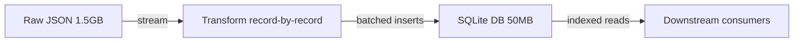

# Streaming Large Data

**TL;DR:** When your input is larger than RAM, you stream it — process records one at a time, holding only the current record and small accumulator state in memory.

---

## What it is

The naive way to read a JSON file:

```python
with open("data.json") as f:
    cards = json.load(f)     # loads everything into RAM
```

Works for small files. Blows up for big ones — a 1.5 GB JSON file becomes a 5+ GB Python object once parsed (dicts/lists carry per-object overhead, ~200 bytes per object).

The streaming version reads records one at a time:

```python
import ijson
with open("data.json", "rb") as f:
    for card in ijson.items(f, "item"):  # iterates without holding the whole list
        process(card)
```

`ijson` is an **incremental parser**. It emits events ("array start", "key", "value", "array end") as it reads bytes, never holding more than the current parse path in memory.

---

## Why it matters

**For the project:** Scryfall's `default_cards` bulk file is ~500 MB JSON. Streaming keeps memory well under 500 MB; loading it all uses 2+ GB.

**For ML engineering jobs:** Training datasets are routinely huge. Streaming appears everywhere:

| Framework | Streaming construct |
|---|---|
| PyTorch | `IterableDataset` |
| TensorFlow | `tf.data.Dataset` |
| HuggingFace `datasets` | `streaming=True` |
| Pandas | `read_csv(chunksize=...)` |
| PyArrow | row-group iteration over Parquet |
| Spark | (implicit — every DataFrame is conceptually streamed) |

Common interview prompt: **"How would you train on a 1 TB dataset?"** Streaming is the right starting point. Then you escalate to distributed (Spark/Dask) only if you have to.

---

## The trade-off

| | Load-all | Stream |
|---|---|---|
| Memory | High (proportional to dataset size) | Low (constant) |
| Random access | Yes | No (sequential only) |
| Multi-pass | Free | Re-read from disk each time |
| Indexing | In-memory | External structure required |
| Latency to first record | High (load) then 0 | Low immediately |
| Total throughput | Often higher (vectorized) | Usually lower |

If you need many passes or random access, streaming forces a redesign — usually a database (SQLite/Parquet) sitting between the raw stream and downstream consumers.



---

## Watch out for

- **Accumulator blowup.** Streaming doesn't help if you append every record to a list. Watch for `all_records = []` — defeats the purpose.
- **Multi-pass needs.** If your transform requires "max of X across the whole dataset," you need a separate aggregation pass or an external structure.
- **Error recovery.** A streaming parser dies on a single bad record at byte 700M. Plan for it: log + skip, or write a tolerant parser, or fail loud with a position offset.
- **Streaming + multithreading.** Producer/consumer queues matter. Naive threading inside a streaming loop is a footgun.
- **Side effects.** A streaming pipeline that performs DB inserts is harder to retry idempotently than a batch one.

---

## In Phase 1

`build_db.py` streams Scryfall card-by-card via `ijson.items(fh, "item")`, normalizes each, and batches inserts into SQLite. The only accumulator state is:

- `sets_seen`: a dict of sets we've encountered (small — a few hundred sets)
- An in-flight batch buffer (5000 cards max before flush)

So memory stays low even for the much larger 800K-card `all_cards` variant if we ever expand scope.

---

## Patterns to know

### Batched flush

```python
BATCH = 5000
buf = []
for record in stream:
    buf.append(transform(record))
    if len(buf) >= BATCH:
        write(buf)
        buf.clear()
write(buf)  # flush remainder
```

### Two-pass aggregation

If you need a global statistic (e.g. max value, vocabulary):

```python
# Pass 1: aggregate
max_val = -float("inf")
for record in stream:
    max_val = max(max_val, record["value"])

# Pass 2: transform using the aggregate
for record in stream2():
    yield normalize(record, max_val)
```

### Reservoir sampling

When you want a fixed-size random sample of an unknown-size stream — the classic interview question:

```python
import random
reservoir = []
for i, record in enumerate(stream):
    if i < K:
        reservoir.append(record)
    else:
        j = random.randint(0, i)
        if j < K:
            reservoir[j] = record
```

---

## See also

- [Reproducible pipelines](reproducible-pipelines.md) — streaming and reproducibility interact (input order can affect output)
- [SQLite for read-mostly workloads](../data-engineering/sqlite-readmostly-design.md) — the natural sink for streamed data

---

## Interview angle

> **"How would you process a dataset that doesn't fit in memory?"**

Senior answer covers:

1. Streaming with record-level iteration (mention the specific tool: PyArrow, ijson, HuggingFace streaming, tf.data, PyTorch IterableDataset)
2. Batch writes to durable storage
3. External structure (DB, search index, on-disk feature store) for downstream random access
4. When to escalate to distributed (Spark / Dask) — typically when one machine's local disk is the bottleneck
5. Trade-off: streaming is harder to debug and harder to multi-pass, so prefer it only when needed
