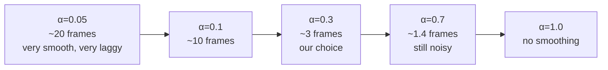

# Temporal Smoothing of ML Output

**TL;DR:** When you run a model on a stream of correlated inputs (video frames, sensor readings, recurring user actions) and the **per-input** output is noisy, average the outputs over time. The simplest tool is an **exponential moving average** (EMA) — one line of code, one tunable parameter (α), no extra inference cost. It's the workhorse of production ML output smoothing.

---

## What it is

You have a model $f$ producing an output $y_t = f(x_t)$ for each timestep $t$. Even if your model is perfect on each $x_t$, the outputs can still **jitter** when:

- The model's gradients on the decision boundary are noisy (different but visually-similar $x_t$ give different $y_t$)
- The input itself is noisy (sensor noise, slight hand motion, lighting flicker)
- The output is highly nonlinear in the input (small input changes → big output changes)

Smoothing averages your output over recent history:

$$\hat{y}_t = (1 - \alpha) \cdot \hat{y}_{t-1} + \alpha \cdot y_t$$

- $\alpha = 0$ → output never updates (frozen).
- $\alpha = 1$ → no smoothing (output = current observation).
- $\alpha = 0.3$ → roughly 3-frame "memory" — feels responsive but cuts noise meaningfully.

This is an **exponential moving average**. It has constant memory (one previous estimate) and constant compute (one weighted average per timestep). Cheaper than any model, applicable to almost any output.

---

## Why it matters

**For this project:** Phase 2's overlay was jittery because we were drawing Vision's raw per-frame corners. Smoothing those corners with α = 0.3 plus a 3-frame hysteresis (don't clear the overlay on a single missed detection) made the overlay stable without measurable lag.

**For ML engineering jobs:** EMA is **everywhere**. Knowing this pattern by name and being able to articulate it cleanly is a senior-engineer signal.

| Where it shows up | How it's used |
|---|---|
| Batch Normalization | Running mean/var of activations, EMA-smoothed during training, frozen at inference |
| Adam / RMSProp optimizers | EMA of gradients (first moment) and squared gradients (second moment) |
| RL: target networks | Slow EMA of the online network's weights — Polyak averaging |
| Streaming click prediction | EMA of recent click-through rates per user/item |
| Sensor fusion | Low-pass filter on IMU (gyro/accelerometer) data |
| Generative models (EMA of model weights) | Used for inference; gives smoother, often better samples than the raw training weights |
| Online anomaly detection | EMA of baseline; alert when current point > k·σ from baseline |
| Real-time MLOps dashboards | EMA-smoothed metrics so dashboards don't flicker |

---

## The math, two flavors

### EMA (what we're using)

$$\hat{y}_t = (1 - \alpha) \cdot \hat{y}_{t-1} + \alpha \cdot y_t$$

**Effective memory** ≈ $1/\alpha$ samples. α = 0.1 averages over ~10 samples; α = 0.3 over ~3.

### Simple moving average (SMA)

Average the last $N$ observations explicitly:

$$\hat{y}_t = \frac{1}{N} \sum_{i=t-N+1}^{t} y_i$$

Requires a buffer of size $N$. Higher memory cost. Each sample weighted equally — older samples don't fade out.

**Use EMA over SMA** unless you have a hard requirement to discard observations older than $N$ steps. EMA's "soft" forgetting is usually what you want.

---

## How to pick α

Three rules of thumb:

1. **Latency you're willing to absorb.** If new information should reach the output within ~$k$ samples, set α ≈ 1/$k$.
2. **Frame rate × time constant.** For a 30 fps source where you want ~0.1 s smoothing, time constant = 3 frames → α ≈ 1/3.
3. **Adaptive.** Use a higher α when changes are large (snap to new value), lower α when changes are small (smooth out noise). This is the start of Kalman-filter territory.

For our overlay, we picked α = 0.3 — about 3 frames at 30 fps, ≈ 100 ms time constant. Tunable by changing the constant.



---

## When NOT to use EMA

EMA assumes the output is **continuous** and **unimodal** in some sense. It breaks for:

- **Discrete categorical output** — averaging "Lightning Bolt" with "Mountain" makes no sense. Smooth confidences instead, then re-argmax.
- **Multimodal output** — if your model legitimately oscillates between two valid answers, averaging gives you a third (wrong) one in the middle. Use majority voting or per-mode tracking.
- **Sharp changes you want to detect** — if the system is monitoring for sudden shifts (e.g., anomaly detection), smoothing hides the very signal you care about. Use a *change-point detector* instead.
- **Adversarial inputs** — an attacker can game an EMA-smoothed output by feeding adversarial inputs that hover near a target value.

In our case, corner positions are continuous and unimodal (one card at a time). EMA is appropriate.

---

## Hysteresis: surviving missing observations

EMA assumes one observation per timestep. What if the detector misses a frame entirely (no card found)?

Two options:

1. **Clear immediately on miss.** Overlay disappears, then re-appears on next detection. Causes visual flicker.
2. **Tolerate $K$ consecutive misses, then clear.** Smooths over single-frame failures; still responds reasonably when the card actually leaves.

We chose option 2 with $K = 3$ — buys us ~100 ms of grace before declaring "no card." This pattern is **hysteresis**: thresholds for "turn on" and "turn off" are different, preventing rapid toggling around the boundary.

In control systems, this is built into thermostats so the AC doesn't cycle 60 times per hour around a setpoint. In ML output, it prevents UI flicker around the detection boundary.

---

## Kalman filter: the principled cousin

EMA assumes constant noise. The **Kalman filter** explicitly tracks the *uncertainty* of each estimate and weights new observations by their inverse variance. When the new observation is noisy (high variance), it contributes less; when it's confident, it contributes more.

A 1D Kalman filter is just a few lines:

```python
# State: estimate + variance
x_hat = initial_estimate
p = initial_variance

# Process noise q (how much state drifts per step)
# Measurement noise r (how noisy each observation is)

def update(z):              # z = new observation
    global x_hat, p
    p_pred = p + q
    k = p_pred / (p_pred + r)   # Kalman gain — dynamic α
    x_hat = x_hat + k * (z - x_hat)
    p = (1 - k) * p_pred
    return x_hat
```

The Kalman gain $k$ is a dynamic α. When your model is uncertain (high $p$) or the observation is precise (low $r$), $k$ is large — trust the observation. When the model is confident or the observation is noisy, $k$ is small — stick with the prediction.

**When to upgrade from EMA to Kalman:**

- The noise level varies significantly over time
- You have a prior on how the state evolves between observations
- You need calibrated uncertainty (not just a smoothed point estimate)

For our scanner v1, EMA is enough. For Phase 5's multi-frame card identification, we use the proper Bayesian posterior — see [bayesian-streaming-inference.md](bayesian-streaming-inference.md), which is the discrete-state cousin of the Kalman filter.

---

## Watch out for

- **Initial value bias.** EMA needs $\hat{y}_0$ to be initialized somehow. We init with the first non-nil observation. Others init with 0 or the mean. Avoid initializing with a value that's far from typical — early steps will reflect the bias.
- **Choosing α from intuition, then never measuring it.** Plot the response: feed in a step input and see how long until $\hat{y}_t$ settles. Tune from data, not vibes.
- **EMA in non-stationary distributions.** If the underlying process drifts (concept drift in ML), an EMA with small α adapts slowly. Either bump α up or detect drift and reset.
- **Compounding lag with downstream smoothers.** If you smooth in three places, lags compound. Put the smoothing in one place and measure end-to-end latency.
- **EMA on log-probabilities vs probabilities.** Smoothing in log-space gives a geometric-mean-like result; in probability space, an arithmetic mean. Different semantics. Pick deliberately.

---

## In this project

Our `CardDetectionService.updateSmoothedQuad(_:)` runs on every Vision frame:

```swift
if let raw {
    framesWithoutDetection = 0
    if let prev = detectedQuad {
        detectedQuad = CardQuad.lerp(prev, raw, alpha: 0.3)  // EMA per corner
    } else {
        detectedQuad = raw  // first observation: snap in
    }
} else {
    framesWithoutDetection += 1
    if framesWithoutDetection > 3 {
        detectedQuad = nil  // hysteresis: only clear after 3 missing frames
    }
}
```

Each corner is smoothed independently. For nearly-rigid card motion, this is fine — the corners move together. If we ever observe corner-drift (the quad warping non-rigidly), we'd switch to smoothing the *center + size + rotation* of the rectangle, then re-derive corners.

---

## See also

- [Bayesian streaming inference](bayesian-streaming-inference.md) — the proper Bayesian generalization, used in Phase 5
- [Streaming large data](streaming-large-data.md) — both topics share the "single-pass, bounded memory" mindset

---

## Interview angle

> **"Your model's per-frame predictions are jittery in production. What do you do?"**

A senior answer:

1. **Verify it's a smoothing problem and not a model-quality problem first** — is your model uncalibrated, or is the input genuinely changing?
2. **Smooth the output with EMA** — cheapest fix, no retraining, one parameter
3. **Tune α from latency-vs-stability tradeoff**, plot a step response
4. **Add hysteresis if you have on/off thresholds** to prevent flicker
5. **Upgrade to a Kalman filter** when noise varies or you need calibrated uncertainty
6. **If smoothing isn't enough**, look at training-time fixes: more augmentation, lower learning rate at the end of training, EMA of model weights, distillation

Bonus: mention that Adam's bias correction is also EMA-related — initial-step bias compensation.
